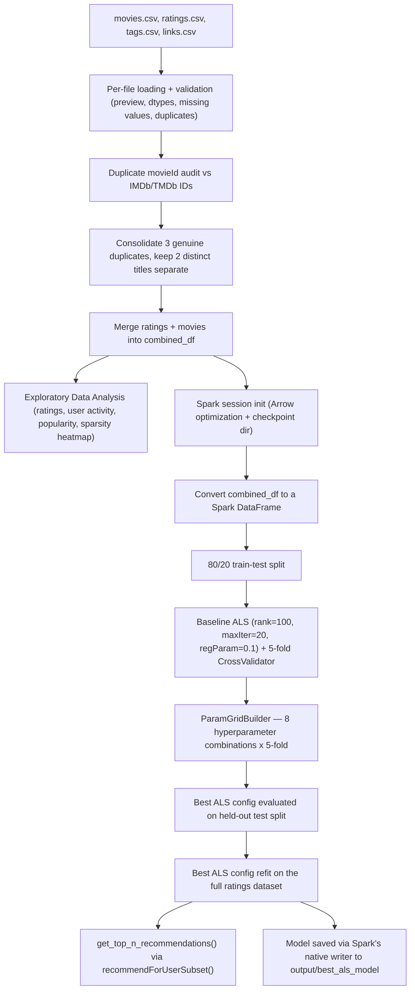

# 🎬 Movie Recommendation System (ALS Collaborative Filtering via Apache Spark)

Personalized movie recommendations learned purely from rating patterns, built on a distributed engine so the same approach can scale from a laptop to a cluster without changing algorithms.


-E25A1C?style=flat&logo=apachespark&logoColor=white)

-orange?style=flat)


## 📌 Overview

This repository contains a Jupyter/Kaggle notebook that builds a collaborative filtering movie recommender using **Alternating Least Squares (ALS)** matrix factorization, implemented with **Apache Spark's MLlib** (`pyspark.ml.recommendation.ALS`), trained on the same **MovieLens "latest small" dataset** used throughout this line of work (100,836 ratings from 610 users across 9,721 rated movies).

The notebook covers the same data foundation as its companion SVD-based project (loading and validating all four raw MovieLens CSVs, auditing and resolving duplicate movie IDs against external IMDb/TMDb identifiers, and running exploratory data analysis), then diverges at the modeling stage. Instead of a single-machine, `scikit-surprise`-based SVD model, this version initializes a Spark session, converts the cleaned ratings into a Spark DataFrame, trains an ALS model with 5-fold cross-validation, runs a small hyperparameter grid search, refits the best configuration on the full dataset, and generates personalized top-10 recommendations using Spark's own `recommendForUserSubset` API before saving the trained model to disk.

### ✨ Key Features
* 📂 **Structured multi-file ingestion.** All four MovieLens CSVs (`movies`, `ratings`, `tags`, `links`) are loaded with a repeatable diagnostic routine covering head/tail/sample previews, dtypes, summary statistics, missing values, duplicated rows, and per-column unique value counts.
* 🔍 **Duplicate movie ID audit.** Titles mapped to more than one `movieId` are cross-referenced against their IMDb/TMDb identifiers to tell genuine data-linking errors apart from distinct films that happen to share a title. Three titles (*Confessions of a Dangerous Mind*, *Eros*, *Saturn 3*) are consolidated, while two others (*Emma*, *War of the Worlds*) are explicitly kept separate because their genres and TMDB IDs confirm they're different productions.
* 📊 **Exploratory data analysis suite.** Rating distribution, user activity distribution, the top 5 most active and most generous/critical raters, movie popularity and rating leaders, and a full user-item sparsity heatmap (98.30% sparse).
* ⚡ **Distributed training via Apache Spark.** A Spark session is initialized with Apache Arrow optimization enabled for faster pandas-to-Spark conversion, and a checkpoint directory is configured specifically to prevent stack overflow errors during ALS's iterative computation lineage.
* 🧠 **ALS collaborative filtering.** An 80/20 train-test split plus 5-fold cross-validation via Spark's `CrossValidator`, reporting RMSE against a single baseline configuration before any tuning happens.
* 🎛️ **Hyperparameter tuning via Spark's ParamGridBuilder.** 8 combinations of `rank`, `maxIter`, and `regParam` are evaluated with 5-fold cross-validation, run in parallel (`parallelism=4`), to check whether a better configuration exists than the initial one.
* 🏭 **Production refit and recommendation generation.** The best configuration found is retrained on the entire ratings dataset (not just the training split), and a `get_top_n_recommendations()` helper wraps Spark's native `recommendForUserSubset` method, clips predicted ratings to the valid 0.5–5.0 range, and merges the results with movie titles and genres for a readable output.
* 💾 **Model persistence.** The final trained ALS model is saved to `output/best_als_model` using Spark's own model writer, which stores it as a directory of Parquet/metadata files rather than a single serialized file.

---

## 🎯 Context & Problem Statement

Recommendation systems aren't just a machine learning exercise, they exist because both sides of a content catalog run into a real, measurable problem without one. On the viewer's side, choosing what to watch out of thousands of options is a well-documented source of decision fatigue: the more options a person is shown with no guidance, the more likely they are to give up on choosing at all and just leave. On the platform's side, that abandoned session has a direct cost. Netflix's own product executives have publicly estimated that their recommendation engine saves the company more than a billion dollars a year, almost entirely through reduced subscriber churn and getting more value out of the content they already pay for, rather than through any single flashy feature. This project explores that same underlying problem from a different angle than its SVD-based companion: not just how to turn rating data into a personalized ranked list, but how to do it in a way that keeps working as the amount of rating data grows well beyond what fits comfortably on one machine.

### 🎬 The Problem
Narrowed down to this specific dataset and notebook, that broader engagement issue shows up as three concrete, technical problems that any collaborative filtering approach has to deal with before it can produce a single usable recommendation. None of them are really about the modeling algorithm's math in isolation, they're about what the system is working with, and running on, before a single prediction gets made: how much of the catalog is realistically reachable by a user without guidance, how trustworthy the raw rating data actually is once you look past the surface, and whether the training approach itself can keep up if that data keeps growing. Getting any of these wrong means the resulting recommendations are either irrelevant, built on corrupted data, or simply too slow and memory-hungry to produce at all once the catalog gets big enough.
1. **A large catalog is a genuine engagement problem, not just an inconvenience.** With thousands of movies to choose from and no personalization, a user is left either scrolling a generic "most popular" list that ignores their individual taste, or manually searching for something they already know they want, which defeats the purpose of having a large catalog in the first place. Every extra minute spent undecided is a minute closer to the person giving up and closing the app, and for whoever runs the catalog, that translates directly into shorter sessions, lower engagement, and ultimately lower retention. This is the same real-world cost Netflix's own published recommendation-savings figures describe.
2. **The rating data available to learn from is sparse and, on top of that, noisy.** The user-item ratings matrix in this dataset is 98.30% empty, meaning the overwhelming majority of user-movie pairs have no rating at all for a similarity-based approach to lean on. To make things harder, a handful of movies were recorded under two different `movieId` values during data collection. Left unresolved, that would split a single film's rating signal across two IDs, understating its true popularity to the model and diluting the very signal any recommender is trying to learn from.
3. **A single-machine training approach doesn't scale with the data.** A library like `scikit-surprise`, used in this project's SVD companion notebook, loads the entire rating matrix and trains entirely in one process's memory. That's perfectly fine at 100k ratings, but a platform with a genuinely large catalog and user base can be dealing with hundreds of millions or billions of interactions, at which point a single-machine, in-memory approach either runs out of memory or simply takes too long to retrain on a reasonable schedule.

### 💡 The Solution
Solving the broader engagement problem starts by solving these three specific, technical ones, and each is addressed by a deliberate piece of the pipeline rather than a generic modeling choice made for its own sake. Rather than reaching for a hand-crafted similarity rule that would struggle the moment most of the matrix is empty, training on the raw data as-is and hoping the noise averages out, or defaulting to a single-machine library without considering whether it would hold up at scale, the approach here is to fix the data quality issue first, then use a training engine that's built to scale out rather than up.
1. **Matrix factorization (ALS) instead of a fixed similarity rule.** Rather than relying on hand-crafted similarity metrics that struggle when most of the matrix is empty, ALS learns a compact set of latent taste factors for every user and every movie directly from the sparse rating matrix, alternating between solving for user factors and item factors until they converge. Those learned factors let the model estimate a rating for movies a user has never rated, closing the gap described in problem 1 with a genuinely personalized ranked list instead of a generic most-popular chart.
2. **A manual, IMDb/TMDb-verified duplicate ID audit before any training happens.** By checking each duplicated title's external identifiers before merging anything, the pipeline consolidates the IDs that are genuinely the same film while explicitly leaving distinct adaptations alone. This directly protects the integrity of the matrix that problem 2 identified as noisy, so the model is learning from clean, correctly-attributed rating signals rather than fragmented or wrongly-merged ones.
3. **Training on Apache Spark instead of a single-process library.** ALS here runs through Spark MLlib, which partitions the user-item matrix across a cluster of machines and solves the alternating least-squares updates in a distributed fashion. On this small dataset that distribution overhead doesn't buy a speed advantage over a single-machine library, but the same code and the same algorithm can, in principle, be pointed at a Spark cluster processing a catalog many orders of magnitude larger, which is exactly what problem 3 identified as the limit of a single-machine approach.

Even with all three in place, the current version still has real gaps, covered in the Conclusion, System Limitations, and Future Work sections below.

---

## 📊 Quantitative Metrics

Ratings in this dataset run on a 0.5 to 5.0 scale, so an RMSE around 0.87 to 0.90 means the model's predicted rating is, on average, close to one star off from the true rating.

| Stage | RMSE ↓ | MAE ↓ | R² |
| :--- | :---: | :---: | :---: |
| Single-config, 5-fold CV average (`rank=100`, `maxIter=20`, `regParam=0.1`) | 0.8993 | not measured in CV | not measured in CV |
| Baseline (same config), held-out test split | 0.8742 | 0.6749 | 0.2878 |
| Grid search best of 8 combinations, 5-fold CV average | 0.8993 | not measured in CV | not measured in CV |
| **Final (best) model, held-out test split** | **0.8742** | **0.6749** | **0.2878** |

**Hyperparameter search space:** `rank` in `[50, 100]`, `maxIter` in `[15, 20]`, `regParam` in `[0.05, 0.1]` (8 combinations total, 5-fold cross-validation each, run with `parallelism=4`).

**A note on the tuning result, in the interest of not overstating it:** the grid search's best configuration turned out to be identical to the configuration already tested as the single-parameter baseline (`rank=100`, `maxIter=20`, `regParam=0.1`), which is why the baseline and final rows above show exactly the same numbers. In other words, tuning here confirmed that the initial configuration was already the best one among those tried, rather than discovering an improvement over it, which is a different outcome than this project's SVD companion notebook, where `GridSearchCV` did find a measurably better configuration than its baseline.

*RMSE = Root Mean Squared Error, MAE = Mean Absolute Error, R² = coefficient of determination (share of rating variance the model's predictions explain on the held-out set; individual movie ratings are inherently noisy, so a moderate R² like 0.29 here is typical for this kind of collaborative filtering evaluation rather than a sign of a broken model).*

---

## 🏗️ Architecture & Data Flow



---

## 💻 Installation & Reproduction Steps

### 📋 Prerequisites
* **Python 3.10 or newer** is required.
* **A Java Development Kit (JDK) is required for PySpark to run at all.** PySpark is a Python wrapper around the Java-based Apache Spark engine, so it needs a working JVM underneath it, something that doesn't show up anywhere in the notebook's `import` statements. Java 17 (LTS) is the version most commonly recommended for current Spark 3.x releases, though Java 11 is also widely supported. After installing a JDK, make sure `JAVA_HOME` is set and `java -version` resolves correctly in the same terminal you'll run the notebook from, or Spark will fail to start with a `JAVA_HOME is not set` style error.
* No GPU is needed. ALS in Spark MLlib runs on CPU, distributed across however many local threads (or cluster executors) Spark is configured to use.

### 🛠️ CLI Installation & Execution

#### 1. Clone the Repository
```bash
git clone https://github.com/viochris/movie-recommendation-als.git
cd movie-recommendation-als
```

#### 2. Create and Activate a Virtual Environment
```bash
# macOS/Linux
python3 -m venv venv
source venv/bin/activate

# Windows
python -m venv venv
venv\Scripts\activate
```

#### 3. Install Dependencies
```bash
pip install --upgrade pip
pip install -r requirements.txt
```

#### 4. Get the Dataset
The notebook was built on Kaggle and reads the MovieLens "latest small" dataset from `/kaggle/input/...`. To run it locally, download the same dataset directly from [GroupLens](https://grouplens.org/datasets/movielens/latest/) (the "ml-latest-small.zip" package), extract `movies.csv`, `ratings.csv`, `tags.csv`, and `links.csv` into a local `data/` folder, and update the `file_paths` list near the top of the notebook to point to that folder instead of the Kaggle input path.

#### 5. Run the Notebook
```bash
jupyter notebook movie-recomendation-als.ipynb
```
Run all cells from top to bottom. The 8-combination grid search with 5-fold cross-validation is the slowest step by far (roughly 14 minutes on the original run, versus about 4 minutes for the single-configuration baseline cross-validation), since Spark's job scheduling and checkpointing overhead is more noticeable at this small data scale than it would be on a genuinely large dataset.

---

## 📝 Conclusion

Putting the whole pipeline together, this project set out to solve three concrete problems: a large, unpersonalized catalog that costs engagement, a sparse and noisy rating dataset that makes a naive similarity approach unreliable, and a training approach that needs to hold up if the amount of rating data keeps growing. The ALS-based collaborative filtering pipeline built here addresses all three directly. It learns latent taste factors purely from the rating matrix, which lets it rank the entire unwatched catalog for any given user instead of falling back on a generic popularity list. It does so on top of the same manually audited dataset used in the SVD companion project, where duplicate movie IDs were resolved against external IMDb/TMDb identifiers first. And it runs the whole training process through Apache Spark's distributed ALS implementation rather than a single-machine library, so the same code path is, in principle, ready to be pointed at a Spark cluster and a catalog far larger than this one without a fundamental redesign.

The numbers here are honest rather than flattering, which is worth being upfront about. The final model reached an RMSE of 0.8742 and an MAE of 0.6749 on the held-out test set, both in a similar range to the SVD companion project's baseline, but the 8-combination grid search did not find a configuration better than the one already tested as the initial baseline, unlike the SVD project where tuning produced a clear improvement. That's a legitimate result rather than a failure of the notebook, it simply means that within the 8 combinations tried, the original configuration already happened to be the best one, but it's worth stating plainly rather than implying the tuning step accomplished more than it did.

This is a solution to the three problems above specifically, not a complete, production-ready recommender. It still has real, honest gaps. The model has no way to score a movie or a user it has never seen a rating for, since it learns exclusively from historical `(userId, movieId, rating)` triples and ignores genre, tag, and other metadata that's already sitting in the dataset. The hyperparameter search covered only 8 combinations rather than a wider or continuous space, so there's a reasonable chance a better configuration exists outside what was tried. And despite running on Spark, the entire system currently lives inside a single notebook, with no API or interface to query it interactively, and no actual multi-machine cluster was used to validate the scalability argument on this small dataset. The sections immediately below go through each of these gaps in detail and lay out concrete next steps for closing them.

---

## ⚠️ System Limitations

### 🏗️ Architectural Limitations
* **No serving layer.** Recommendations are only produced by calling `get_top_n_recommendations()` inside the notebook. There's no API endpoint or UI to query the trained model interactively without opening and rerunning cells.
* **Distributed overhead with no distributed benefit, yet.** The notebook runs Spark in local mode on a single machine, so it pays for Spark's job scheduling, serialization, and checkpointing overhead without actually gaining a speed advantage from distribution. The scalability argument for using Spark is architectural and forward-looking rather than something this specific run demonstrates, since a genuinely large, multi-node cluster was never used here.
* **Single held-out split for the final numbers.** The final model's headline metrics come from one 80/20 train-test split layered on top of the 5-fold cross-validation used during grid search, so those specific numbers carry a bit more split-to-split variance than the cross-validated averages do.
* **Unused imports left over from a shared template.** The setup cell imports a wide range of classification and tuning libraries (XGBoost, LightGBM, CatBoost, `imbalanced-learn`, LIME, several scikit-learn classifiers, `joblib`, and Optuna) that are never actually called anywhere in this notebook's ALS pipeline. `joblib` in particular is worth calling out since the final model is saved through Spark's own writer, not `joblib.dump()`. These all appear to be carried over from a shared project template rather than being specific to this model.

### 🔬 Model & Domain Limitations
* **Structural cold-start problem.** ALS here learns purely from `(userId, movieId, rating)` triples. It has no way to score a brand-new movie that has zero ratings yet, or a brand-new user with no rating history at all, because there's no learned latent vector for either one to fall back on. `genres.csv` and `tags.csv` are loaded and used for display and duplicate-ID resolution, but never as model input, so none of that metadata currently helps with this gap. Spark's `coldStartStrategy="drop"` setting only prevents `NaN` predictions from breaking the evaluation metrics on known users and items with no overlap in a given fold, it doesn't solve cold start for genuinely new users or movies.
* **A narrow, non-improving hyperparameter search.** Only 8 combinations of `rank`, `maxIter`, and `regParam` were tried, and the search happened to reconfirm the already-tested baseline rather than surface a better configuration. That doesn't mean a better configuration doesn't exist, it means it wasn't found within this particular, fairly small search space.
* **Small dataset relative to the technology's intended scale.** The entire point of choosing Spark and ALS is to handle data too large for one machine, but this notebook runs on the same ~100k-rating MovieLens dataset as its SVD companion, which comfortably fits in memory on a laptop. That means the scalability benefits this architecture is built for are not actually exercised or measured here.
* **R² is modest, which is expected but worth naming plainly.** An R² of 0.2878 means the model explains a limited share of the variance in individual ratings on the held-out set. That's a normal outcome for collaborative filtering on explicit ratings, where a lot of the variance in any single rating comes down to individual mood and taste that no amount of pattern-matching across other users can fully capture, but it's worth stating rather than glossing over.

---

## 🚀 Future Work
* **Actually test at scale.** Run this same pipeline against a substantially larger MovieLens release (1M or 25M ratings) or a synthetic dataset generated to be much larger, ideally on a real multi-node Spark cluster or a cloud-managed Spark service, to see whether the scalability argument for choosing ALS over a single-machine library holds up in practice rather than just in theory.
* **Widen the hyperparameter search.** Since the 8-combination grid didn't surface an improvement, trying a wider range of `rank` and `regParam` values, or switching to Spark's `TrainValidationSplit` for a faster (if less thorough) search, could reveal whether a genuinely better configuration exists outside the range already tested.
* **Hybrid or content-based signals for cold start.** `genres.csv` and `tags.csv` are already being loaded. Feeding that metadata into the model, or blending it with a content-based similarity score, would give the system something to fall back on for new movies and new users that pure collaborative filtering can't score today.
* **Benchmark directly against the SVD companion project** on identical train/test splits, to get an apples-to-apples comparison of accuracy, not just an assumption that ALS and SVD should perform similarly.
* **Wrap `get_top_n_recommendations()` in a small API or Streamlit demo** so recommendations can be queried interactively instead of by editing and rerunning notebook cells.
* **Incorporate implicit feedback signals**, like tagging activity or watch counts, alongside the explicit star ratings for a potentially richer training signal.

---

## 📄 License
This project is licensed under the MIT License. See the [LICENSE](LICENSE) file for details.

---
**Author:** [Silvio Christian Joe](https://github.com/viochris)

*"Recommending from patterns, not opinions, at whatever scale the data demands."*
